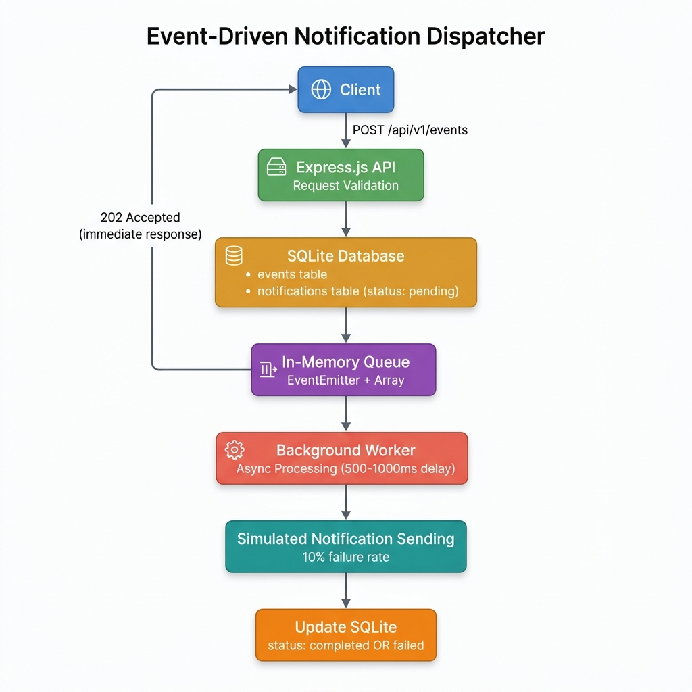

# Event-Driven Notification Dispatcher

A lightweight, asynchronous notification system built with **Express.js**, **Node.js**, and **SQLite**. The system exposes a REST API to trigger business events (e.g., `order_placed`), queues notification tasks in-memory, and processes them asynchronously in the background.

---

## Architecture Diagram



### System Flow

```
Client
  │
  ▼
POST /api/v1/events
  │
  ▼
Express.js API (Request Validation)
  │
  ▼
Save event → SQLite `events` table
  │
  ▼
Create notification → SQLite `notifications` table (status: pending)
  │
  ▼
Push task → In-Memory Queue (EventEmitter + Array)
  │
  ├──────────────────────────────────────────┐
  ▼                                          ▼
Return 202 Accepted              Background Worker picks up task
(immediate response)                         │
                                             ▼
                                  Simulate sending (500–1000ms delay)
                                             │
                                             ▼
                                  Update notification status in SQLite
                                  (completed | failed)
```

---

## Tech Stack

| Technology | Purpose |
|---|---|
| **Node.js** | Runtime environment |
| **Express.js** | HTTP server & REST API framework |
| **SQLite** | Lightweight relational database |
| **better-sqlite3** | Synchronous SQLite driver for Node.js |
| **dotenv** | Environment variable management |
| **EventEmitter** | Native Node.js event-driven queue mechanism |

---

## Project Structure

```
project-root/
├── src/
│   ├── app.js                          # Express app configuration
│   ├── server.js                       # Entry point — starts server & worker
│   ├── controllers/
│   │   └── eventController.js          # Request validation & orchestration
│   ├── services/
│   │   ├── eventService.js             # Event database operations
│   │   ├── notificationService.js      # Notification database operations
│   │   └── queueWorker.js             # In-memory queue & background worker
│   ├── db/
│   │   ├── database.js                 # SQLite connection & schema initialization
│   │   └── schema.sql                  # DDL for events & notifications tables
│   └── routes/
│       └── eventRoutes.js              # Route definitions
├── architecture-diagram.png            # System architecture diagram
├── package.json                        # Project dependencies & scripts
├── .env.example                        # Environment variable template
├── .gitignore                          # Git ignore rules
└── README.md                           # This file
```

---

## Prerequisites

- **Node.js** v18 or higher
- **npm** v9 or higher

---

## Installation

### 1. Clone the repository

```bash
git clone <repository-url>
cd event-driven-notification-dispatcher
```

### 2. Install dependencies

```bash
npm install
```

### 3. Set up environment variables

Copy the example environment file:

```bash
cp .env.example .env
```

The default configuration is:

```env
PORT=3000
DB_PATH=./data/notifications.db
```

You can modify these values as needed.

### 4. Database setup

**No manual setup required.** The SQLite database and tables are created automatically when the application starts for the first time. The database file is stored at the path specified by `DB_PATH` in your `.env` file (default: `./data/notifications.db`).

The schema is defined in `src/db/schema.sql` and includes two tables:

- **events** — Stores incoming business events
- **notifications** — Stores notification tasks with status tracking

---

## Running the Application

### Start the server

```bash
npm start
```

### Start with auto-reload (development)

```bash
npm run dev
```

The server will start on `http://localhost:3000` (or the port specified in `.env`).

You should see the following output:

```
[Database] SQLite database initialized successfully
[Worker] Background queue worker started
[Server] Event-Driven Notification Dispatcher running on http://localhost:3000
[Server] API endpoint: POST http://localhost:3000/api/v1/events
```

---

## API Endpoint

### POST `/api/v1/events`

Trigger a business event and queue a notification for asynchronous processing.

#### Request

**URL:** `http://localhost:3000/api/v1/events`  
**Method:** `POST`  
**Content-Type:** `application/json`

#### Request Body

```json
{
  "event_type": "order_placed",
  "recipient": "user@example.com",
  "data": {
    "order_id": 101
  }
}
```

| Field | Type | Required | Description |
|---|---|---|---|
| `event_type` | string | Yes | The type of business event (e.g., `order_placed`) |
| `recipient` | string | Yes | The notification recipient (e.g., email address) |
| `data` | object | No | Additional event data payload |

#### Success Response

**Status Code:** `202 Accepted`

```json
{
  "message": "Event accepted for processing",
  "tracking_id": 1,
  "notification_id": 1,
  "status": "pending"
}
```

| Field | Type | Description |
|---|---|---|
| `message` | string | Confirmation message |
| `tracking_id` | integer | The ID of the created event (used for tracking) |
| `notification_id` | integer | The ID of the created notification |
| `status` | string | Initial notification status (`pending`) |

#### Error Responses

**400 Bad Request** — Missing required fields:

```json
{
  "error": "event_type and recipient are required"
}
```

**500 Internal Server Error** — Server-side failure:

```json
{
  "error": "Internal server error"
}
```

#### Sample cURL Request

```bash
curl -X POST http://localhost:3000/api/v1/events \
  -H "Content-Type: application/json" \
  -d '{
    "event_type": "order_placed",
    "recipient": "user@example.com",
    "data": {
      "order_id": 101
    }
  }'
```

---

## How the Asynchronous Queue Works

The system uses an **in-memory queue** powered by Node.js's native `EventEmitter` combined with a simple JavaScript array. Here's how it works:

### Architecture

```
┌──────────────────────────────────────────────────┐
│              In-Memory Queue (Array)             │
│  ┌──────┐  ┌──────┐  ┌──────┐                   │
│  │ task │  │ task │  │ task │  ← enqueue()       │
│  └──────┘  └──────┘  └──────┘                    │
│        ↓                                         │
│  EventEmitter emits 'task' event                 │
│        ↓                                         │
│  Worker: shift() → processTask() → update DB     │
└──────────────────────────────────────────────────┘
```

### Flow

1. **Enqueue**: When an API request is received, after saving the event and notification to the database, the notification task is pushed onto an in-memory array and an EventEmitter `'task'` event is emitted.

2. **Worker Activation**: The background worker listens for `'task'` events. When triggered, it begins processing tasks from the queue.

3. **Sequential Processing**: Tasks are processed one at a time (FIFO order) to avoid SQLite write contention. The worker dequeues tasks using `Array.shift()`.

4. **Simulated Sending**: Each notification send is simulated with:
   - A random delay between **500ms and 1000ms** (using `setTimeout`)
   - A **10% failure rate** (using `Math.random() < 0.1`)

5. **Status Update**: After processing, the worker updates the notification record in SQLite:
   - On success → status is set to `completed`
   - On failure → status is set to `failed` and `retry_count` is incremented

### Key Design Decisions

- **Non-blocking**: The API returns `202 Accepted` immediately without waiting for notification processing
- **No external dependencies**: Uses native Node.js patterns (EventEmitter + Array) instead of Redis, RabbitMQ, etc.
- **Sequential processing**: Processes one task at a time to avoid SQLite write contention
- **Error isolation**: Worker errors are caught and logged without crashing the main process

---

## Error Handling

The application handles the following error cases:

| Error Case | HTTP Status | Response |
|---|---|---|
| Missing `event_type` | 400 | `{"error": "event_type and recipient are required"}` |
| Missing `recipient` | 400 | `{"error": "event_type and recipient are required"}` |
| Invalid JSON payload | 400 | `{"error": "Invalid JSON payload"}` |
| Database insert failure | 500 | `{"error": "Internal server error"}` |
| Queue processing failure | Logged | Worker catches and logs errors; does not crash the server |
| Notification update failure | Logged | Worker catches and logs database update errors |

---

## Database Schema

### events

```sql
CREATE TABLE events (
  id INTEGER PRIMARY KEY AUTOINCREMENT,
  event_type TEXT NOT NULL,
  payload TEXT NOT NULL,
  created_at DATETIME DEFAULT CURRENT_TIMESTAMP
);
```

### notifications

```sql
CREATE TABLE notifications (
  id INTEGER PRIMARY KEY AUTOINCREMENT,
  event_id INTEGER NOT NULL,
  recipient TEXT NOT NULL,
  channel TEXT NOT NULL,
  status TEXT NOT NULL CHECK(status IN ('pending', 'completed', 'failed')),
  retry_count INTEGER DEFAULT 0,
  created_at DATETIME DEFAULT CURRENT_TIMESTAMP,
  updated_at DATETIME DEFAULT CURRENT_TIMESTAMP,
  FOREIGN KEY (event_id) REFERENCES events(id)
);
```

---

## Assumptions and Limitations

### Assumptions

- **Single-process deployment**: The application is designed to run as a single Node.js process.
- **Default channel**: All notifications use the `email` channel as specified.
- **Simulated sending**: Notification sending is simulated (no actual email delivery).
- **`tracking_id`**: Maps to the `event_id` from the events table.

### Limitations

- **In-memory queue**: The queue is not persistent. If the server restarts, any pending tasks in the queue are lost. (Database records with `pending` status would remain but wouldn't be re-queued.)
- **No retry mechanism**: Failed notifications are marked as `failed` with an incremented `retry_count`, but there is no automatic retry logic.
- **No authentication**: The API does not implement any authentication or authorization.
- **Single worker**: Tasks are processed sequentially by a single worker. For high-throughput scenarios, a distributed queue (e.g., Redis, RabbitMQ) would be more appropriate.
- **SQLite concurrency**: SQLite handles one write at a time. The sequential worker design avoids contention, but this would not scale for multiple concurrent workers.

---

## License

ISC
